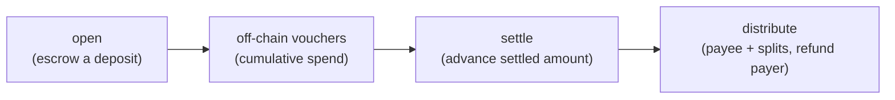
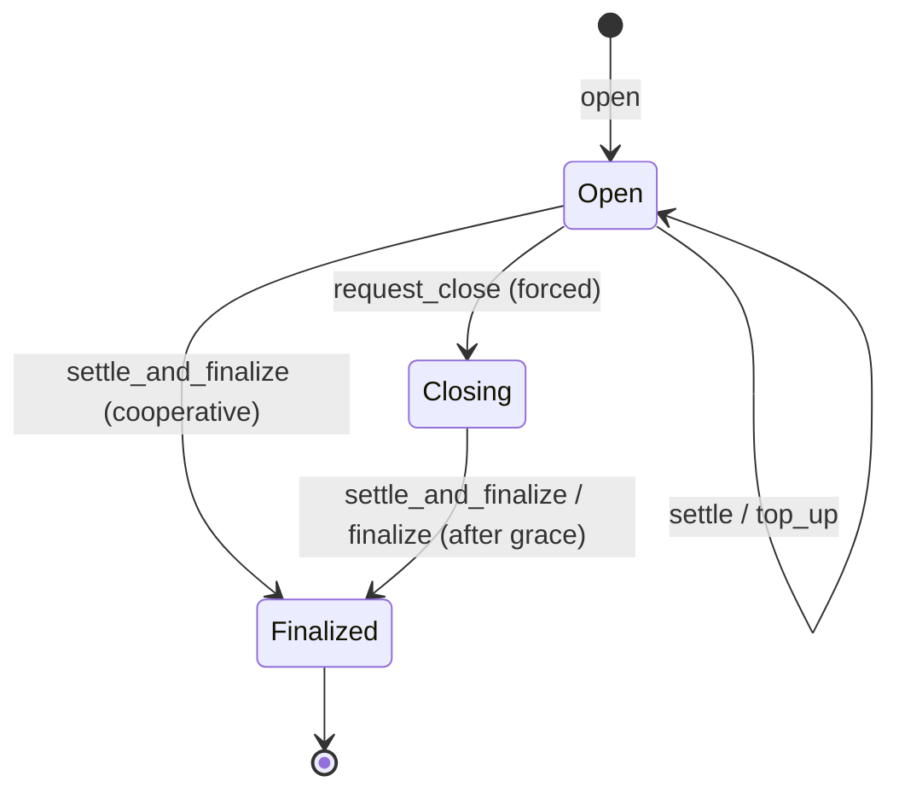

# payment-channels

> Unidirectional payment channels on Solana: escrow a deposit, authorize cumulative spend with off-chain Ed25519 vouchers, then settle and distribute on-chain. A small [Pinocchio](https://github.com/anza-xyz/pinocchio) program over SPL Token / Token-2022.

**Status — live on mainnet:** [`CHNLxYvVA28MJP9PrFuDXccuoGXAx7jBacfLEkahyGsX`](https://explorer.solana.com/address/CHNLxYvVA28MJP9PrFuDXccuoGXAx7jBacfLEkahyGsX)

## Why

One on-chain `open` and one `settle` replace a transaction per payment. The payer escrows a ceiling; the merchant claims only what off-chain vouchers authorize; the payer recovers the rest. That makes **metered, streamed, or many-small** payments viable where settling every request on-chain is too slow and too expensive.

## Lifecycle





Vouchers are signed off-chain (Ed25519) and carry a **cumulative** amount, so a newer voucher supersedes older ones and the program never settles more than the deposit. `distribute` / `withdraw_payer` move the settled funds out and refund the unspent remainder.

## Used by pay.sh

This program is the on-chain settlement layer behind two [pay.sh](https://pay.sh) payment primitives. Both deposit a ceiling here, meter off-chain, and settle the actual amount on this program:

- **x402 `upto`** — a single metered call: the operator settles one voucher for the actual amount and refunds the rest.
- **MPP `session`** — a streamed channel: many cumulative vouchers, settled once when the session idle-closes.

See **[Payment channels](https://pay.sh/docs/building-with-pay/payment-channels/concept)** on pay.sh for the protocol handshakes and when to pick each.

## Instructions

| Instruction | Role |
| --- | --- |
| `open` | Create the channel PDA and escrow the deposit. |
| `settle` | Advance the on-chain settled amount from a signed voucher. |
| `settle_and_finalize` | Settle a final voucher and close in one step (cooperative). |
| `top_up` | Add funds to an open channel. |
| `request_close` | Payer-initiated forced close — starts the grace period. |
| `finalize` | Finalize a forced-closing channel once the grace period elapses. |
| `distribute` | Pay the payee and any split recipients; refund the payer. |
| `withdraw_payer` | Payer recovers the unspent remainder. |

## Build & test

```sh
just setup
just build-program
just generate-client
just test-program
```

Cluster builds (`just build-mainnet-beta`, `just build-devnet`, …) require that cluster's real `TREASURY_OWNER` in `program/payment_channels/src/constants.rs` and refuse to compile with the placeholder. No production keypair is committed — pass the program-id keypair explicitly when deploying.

## Docs & clients

- [State machine](docs/001-payment-channel-state-machine.md)
- [HTTP protocol](docs/002-http-protocol.md)
- [Instruction reference](docs/003-program-instructions.md)
- Generated clients: [TypeScript](clients/typescript), [Rust](clients/rust).

## License

MIT. See [LICENSE](LICENSE).
