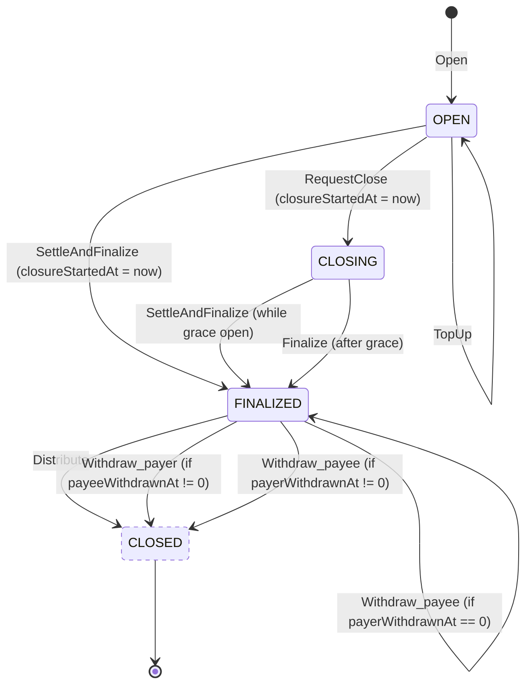

# ADR-001: Payment Channel State Machine

**Status:** Draft

## Context

This ADR specifies the channel lifecycle, instruction set, and on-chain PDA layout for a Solana payment channel program aligned with [`draft-solana-session-00`](https://github.com/solana-foundation/mpp-specs/blob/a64edb477cfcb5e071e4f73f4227cf329dd1c4b5/specs/methods/solana/draft-solana-session-00.md) from the MPP specification.

## Decision

The program implements **unidirectional payment channels** over SPL Token and Token-2022. Each channel is a PDA holding escrowed tokens; payer-signed off-chain vouchers carry a monotonically increasing cumulative amount that on-chain instructions commit to a `settled` watermark. Actual token movement only occurs at closure, via one of two paths:

- **Happy path — `settleAndFinalize` + `distribute`**: the merchant commits the final voucher (locks the watermark, transitions to `FINALIZED`) and then executes the hash-committed multi-destination payout, refunding `deposit − settled` to the payer in the same `distribute` instruction.
- **Unhappy path — post-grace permissionless escape**: after `requestClose` starts the grace period, if the merchant never submits a voucher via `settleAndFinalize`, anyone may call `finalize` post-grace to freeze the watermark and transition `CLOSING → FINALIZED`. From there `withdraw_payer` refunds `deposit − settled` to the payer (independent of payee account state) and `withdraw_payee` sends `settled` to `channel.payee`. The two withdraws are independent and may fire in either order; the second one tombstones the PDA and refunds rent to the payer.

Instructions whose destinations are fully determined by PDA seeds are **permissionless cranks** — anyone can submit the transaction; the authority is encoded in the seeds, the timer, or a preimage, not in the signer.

## Channel State Machine

### Status enum

```rust
#[repr(u8)]
pub enum ChannelStatus {
    Open      = 0,
    Finalized = 1,
    Closing   = 2,
}
```

### Channel PDA

```rust
/// Active channel account. 90 bytes.
#[repr(C)]
pub struct Channel {
    pub deposit:            u64,       // [ 0..8 )  Initial escrow amount
    pub settled:            u64,       // [ 8..16)  Cumulative authorized watermark
    pub closure_started_at: i64,       // [16..24)  Unix ts; 0 = not in closure trajectory
    pub payer_withdrawn_at: i64,       // [24..32)  Unix ts; 0 = payer has not withdrawn
    pub payee_withdrawn_at: i64,       // [32..40)  Unix ts; 0 = payee has not withdrawn
    pub distribution_hash:  [u8; 16],  // [40..56)  Blake3-truncated commitment to splits config
    pub payee:              [u8; 32],  // [56..88)  Fallback destination for withdraw_payee
    pub status:             u8,        // [88..89)  ChannelStatus
    pub bump:               u8,        // [89..90)  Canonical PDA bump
}
```

### FSM



`CLOSED` is drawn dashed because it is **not** a `ChannelStatus` value — it is a visual convergence point representing "the channel is about to be tombstoned". The transition into it is atomic with the final tombstone realloc; there is no persistent `CLOSED` state.

## Transition Guards

| Instruction | From → To | Guard |
|---|---|---|
| `open` | `NONEXISTENT → OPEN` | PDA does not exist |
| `settle` | `OPEN → OPEN` | `settled < voucher.cumulative ≤ deposit` |
| `topUp` | `OPEN → OPEN` | — |
| `settleAndFinalize` | `OPEN → FINALIZED` | merchant signer; voucher optional (if present: `settled ≤ voucher.cumulative ≤ deposit`); sets `closureStartedAt = now` |
| `requestClose` | `OPEN → CLOSING` | sets `closureStartedAt = now` |
| `settleAndFinalize` | `CLOSING → FINALIZED` | merchant signer & `now < closureStartedAt + GRACE`; voucher optional (if present: `settled ≤ voucher.cumulative ≤ deposit`) |
| `finalize` | `CLOSING → FINALIZED` | `now ≥ closureStartedAt + GRACE` |
| `distribute` | `FINALIZED → CLOSED` | `payerWithdrawnAt == 0` & `payeeWithdrawnAt == 0` & hash(preimage) == distributionHash |
| `withdraw_payer` | `FINALIZED → FINALIZED` | `payerWithdrawnAt == 0` & `now ≥ closureStartedAt + GRACE` & `payeeWithdrawnAt == 0` |
| `withdraw_payer` | `FINALIZED → CLOSED` | `payerWithdrawnAt == 0` & `now ≥ closureStartedAt + GRACE` & `payeeWithdrawnAt != 0` |
| `withdraw_payee` | `FINALIZED → FINALIZED` | `payeeWithdrawnAt == 0` & `payerWithdrawnAt == 0` |
| `withdraw_payee` | `FINALIZED → CLOSED` | `payeeWithdrawnAt == 0` & `payerWithdrawnAt != 0` |

## Instructions

| Instruction | Description                                                                                                                         | Caller | Signers |
|---|-------------------------------------------------------------------------------------------------------------------------------------|---|---|
| `open` | Creates the channel PDA, locks the deposit, and commits to the distribution hash.                                                   | anyone | payer |
| `settle` | Advances the on-chain `settled` watermark against a payer-signed voucher. `OPEN` only.                                              | merchant | merchant |
| `topUp` | Adds to `deposit`. `OPEN` only — disallowed once `closureStartedAt > 0`.                                                            | payer | payer |
| `settleAndFinalize` | Optionally commits a final voucher, locks the watermark, and transitions to `FINALIZED`. Sets `closureStartedAt = now` when called from `OPEN`. From `CLOSING`, callable only while the grace period is open. | merchant | merchant |
| `requestClose` | Starts the grace period by setting `closureStartedAt = now`.                                                                        | payer | payer |
| `finalize` | Freezes the current watermark and transitions `CLOSING → FINALIZED`. Permissionless, voucher-free; callable only after the grace period has expired. | anyone | any |
| `distribute` | Verifies the distribution-hash preimage, pays merchant splits, refunds `deposit − settled` to payer, tombstones the PDA.            | anyone | any |
| `withdraw_payer` | Refunds `deposit − settled` to the payer and sets `payerWithdrawnAt = now`. Tombstones the PDA iff `payeeWithdrawnAt != 0`; otherwise stays in `FINALIZED`. | anyone | any |
| `withdraw_payee` | Sends `settled` to the stored `channel.payee` and sets `payeeWithdrawnAt = now`. Tombstones the PDA iff `payerWithdrawnAt != 0`; otherwise stays in `FINALIZED`. Rent refunded to the payer on tombstone. | anyone | any |

**Signers** lists only transaction-level signers (verified by the Solana runtime). Voucher signatures (payer-signed off-chain, verified inside the program via Ed25519 syscall over ix data) are **not** transaction-level signers. `any` means no specific account signature is required — the transaction needs only a fee payer.

**All ixs are fee-sponsorable.** The tx fee payer may be any account (typically the merchant's server, per the MPP HTTP flow) and is distinct from the authority signer; sponsor signatures MUST NOT satisfy authority checks.

## TBD

### Replace tombstone with `init_id` generation marker

Instead of realloc-to-8-bytes + `ClosedChannel` discriminator, fully close the PDA at end-of-life (all rent returned) and add an `init_id: i64` field to `Channel`, set from `Clock::slot` at `open`. Every voucher and preimage binds `channelId = (pda_address, init_id)`; re-opening the same PDA seeds produces a new `init_id`, which cryptographically invalidates any pre-close voucher against the old generation.

This technique allows absolute rent reimbursement on close.
