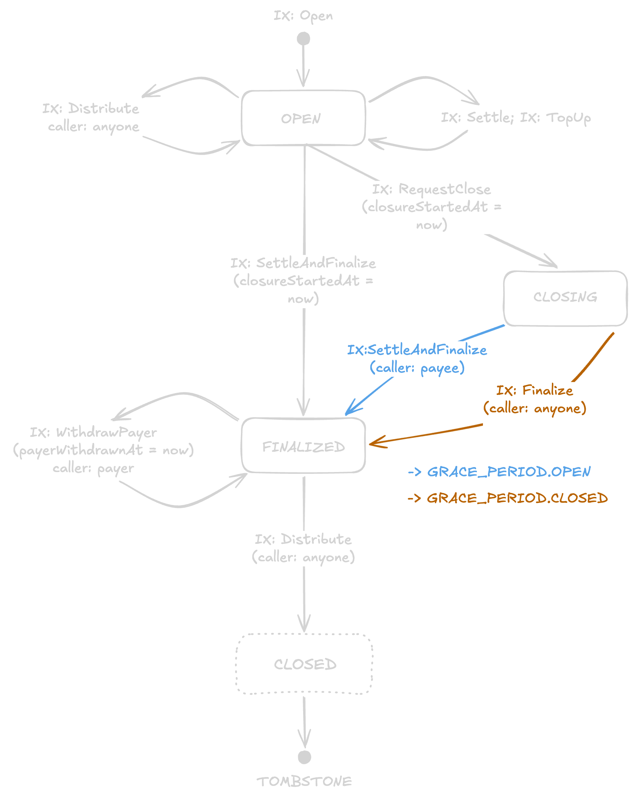

# ADR-001: Payment Channel State Machine

**Status:** Draft

## Context

This ADR specifies the channel lifecycle, instruction set, and on-chain PDA layout for a Solana payment channel program aligned with [`draft-solana-session-00`](https://github.com/solana-foundation/mpp-specs/blob/a64edb477cfcb5e071e4f73f4227cf329dd1c4b5/specs/methods/solana/draft-solana-session-00.md) from the MPP specification.

## Decision

The program implements unidirectional payment channels. Channels are PDAs holding escrowed tokens. Payer-signed off-chain vouchers carry a cumulative amount committed to a `settled` watermark. The split config (a list of `(recipient, shareBps)` with `0 ≤ sum(shareBps) ≤ 10000`) is passed to `open`. The program stores the 32-byte Blake3 digest in `Channel.distribution_hash`. Splits are recoverable from the `open` instruction data. Token movement occurs at closure via two paths:

- **Happy path (`settleAndFinalize` + `distribute`)**: Merchant commits the final voucher (transitions to `FINALIZED`) and runs `distribute` with the splits preimage. The program verifies the Blake3 hash, pays `settled - paid_out` proportionally across recipients, pays the payee's implicit remainder share, sends rounding residual dust to the treasury ATA, refunds `deposit - settled` to the payer, and tombstones the PDA. These instructions SHOULD be bundled.
- **Unhappy path (post-grace permissionless crank)**: If the merchant fails to submit a voucher after `requestClose` starts the grace period, anyone can call `finalize` post-grace to transition to `FINALIZED`. Anyone can then call `distribute` using the publicly recoverable splits preimage. The payer can also pull their refund early during `FINALIZED` via `withdraw_payer`.

Instructions determined by on-chain state are permissionless cranks. Authority is encoded in the channel state, not the signer.

## Channel State Machine

### Status enum

```rust
#[repr(u8)]
pub enum ChannelStatus {
    Open          = 0,
    Finalized     = 1,
    Closing       = 2,
}
```

Zero-initialized accounts are rejected by `AccountDiscriminator::Channel` before
the status byte is interpreted.

### Account discriminator

```rust
#[repr(u8)]
pub enum AccountDiscriminator {
    Channel = 1,                    // starts at 1 so zero-init accounts fail load
    // ClosedChannel = 2,           // reserved for tombstone shape per TBD
}
```

### Channel PDA

```rust
/// Active channel account. 216 bytes.
#[repr(C)]
pub struct Channel {
    pub discriminator:      u8,       // [  0..1  )
    pub version:            u8,       // [  1..2  )
    pub bump:               u8,       // [  2..3  )  canonical bump
    pub status:             u8,       // [  3..4  )
    pub salt:               u64,      // [  4..12 )  PDA disambiguator; stored so `distribute` / `withdraw_payer` can re-derive seeds and self-sign without off-chain data
    pub deposit:            u64,      // [ 12..20 )  escrow amount (mutated by `topUp`)
    pub settled:            u64,      // [ 20..28 )  cumulative authorized watermark
    pub paid_out:           u64,      // [ 28..36 )  paid_out ≤ settled
    pub closure_started_at: i64,      // [ 36..44 )  unix ts; set by `requestClose`, gates `finalize`
    pub payer_withdrawn_at: i64,      // [ 44..52 )  unix ts; 0 = not yet withdrawn
    pub grace_period:       u32,      // [ 52..56 )  seconds; set at `open`
    pub distribution_hash:  [u8; 32], // [ 56..88 )  Blake3 digest of the canonical splits preimage, computed on-chain at `open`
    pub payer:              Address,  // [ 88..120)  refund destination + payer-authority signer
    pub payee:              Address,  // [120..152)  PDA seed binding + implicit-remainder destination on `distribute`
    pub authorized_signer:  Address,  // [152..184)  voucher signer; equals `payer` when no delegate bound
    pub mint:               Address,  // [184..216)
}
```

Multi-byte fields are stored as align-1 `[u8; N]` byte arrays in the actual struct, with `from_le_bytes` / `to_le_bytes` accessors; the typed view above is the logical layout.

### PDA derivation

```text
seeds = [ b"channel", payer, payee, mint, authorized_signer, salt.to_le_bytes() ]
```

- `payer`, `payee`, `mint`, `authorized_signer`: Stored in the struct after `open`.
- `salt: u64`: Disambiguator for concurrent channels. Stored on-chain in `Channel.salt` so `distribute` and `withdraw_payer` can re-derive these seeds for self-signing without off-chain data.
- `bump`: Canonical bump stored in the struct.

Seeds bind all identity parameters, allowing PDA re-derivation for account verification.

### Voucher

Payer-signed off-chain payload authorizing cumulative spend. Committed on-chain via `settle` or `settleAndFinalize`.

#### Off-chain wire format

Carried inside the MPP `Authorization: Payment <base64url-JSON>` HTTP header. Clients exchange the full envelope; only the inner `Voucher` bytes are signed and forwarded on-chain.

```rust
pub struct Voucher {
    pub channel_id:        Pubkey,        // JSON: base58 string
    pub cumulative_amount: u64,           // JSON: decimal ASCII string (base units)
    pub expires_at:        i64,           // JSON: ISO 8601 string when != 0, omitted when 0
}

pub struct SignedVoucher {
    pub voucher:        Voucher,
    pub signer:         Pubkey,           // JSON: base58 string
    pub signature:      [u8; 64],         // JSON: base58 string
    pub signature_type: SigType,          // always SigType::Ed25519
}

#[repr(u8)]
pub enum SigType {
    Ed25519 = 0,
}
```

#### On-chain ix payload

Only the inner `Voucher` bytes ride on-chain — `signer` and `signature` come from the caller-bundled Ed25519 precompile ix, recovered via Instructions-sysvar introspection. The on-chain ix args struct is:

```rust
#[repr(C)]
pub struct VoucherArgs {
    pub channel_id:        Pubkey,        // 32 bytes
    pub cumulative_amount: u64,           //  8 bytes, LE
    pub expires_at:        i64,           //  8 bytes, LE
}
```

Total 48 bytes, stored align-1 (`[u8; 8]` arrays for the two ints). Field order matches `Borsh({ channel_id, cumulative_amount, expires_at })`, so the struct's raw bytes ARE the Ed25519-signed payload — no repack between `VoucherArgs` and the precompile message.

**Verification.** The merchant bundles an Ed25519 native-program ix in the same transaction. The program reads the verified message bytes from that ix via the Instructions sysvar and asserts they equal `VoucherArgs::as_bytes()`. The pubkey embedded in the precompile ix MUST equal `Channel.authorized_signer` (which equals `payer` if no delegate was bound at `open`).

**Replay protection.** `channel_id` (a PDA, hence program- and seed-specific) + monotonic `cumulative_amount > settled` + optional `expires_at`. No explicit nonce.

### FSM



`CLOSED` is a visual convergence point, not a `ChannelStatus` value. The transition is atomic with the tombstone realloc.

## Transition Guards

| Instruction | From → To | Guard |
|---|---|---|
| `open` | `NONEXISTENT → OPEN` | PDA does not exist; `0 ≤ num_splits ≤ MAX_DISTRIBUTION_RECIPIENTS`; `shareBps[i] > 0 ∀ i ∈ [0, num_splits)`; `0 ≤ Σ shareBps[0..num_splits] ≤ 10000` |
| `settle` | `OPEN → OPEN` | `settled < voucher.cumulative ≤ deposit` & voucher fresh† |
| `topUp` | `OPEN → OPEN` | `closureStartedAt == 0` |
| `settleAndFinalize` | `OPEN → FINALIZED` | merchant signer; voucher optional (if present: `settled ≤ voucher.cumulative ≤ deposit` & voucher fresh†) |
| `requestClose` | `OPEN → CLOSING` | sets `closureStartedAt = now` |
| `settleAndFinalize` | `CLOSING → FINALIZED` | merchant signer & `now < closureStartedAt + GRACE`; voucher optional (if present: `settled ≤ voucher.cumulative ≤ deposit` & voucher fresh†) |
| `finalize` | `CLOSING → FINALIZED` | `now ≥ closureStartedAt + GRACE` |
| `distribute` | `OPEN → OPEN` | `Blake3(canonicalized preimage) == distribution_hash` & `settled > paid_out` |
| `distribute` | `FINALIZED → CLOSED` | `Blake3(canonicalized preimage) == distribution_hash` & (`settled > paid_out` OR refund/tombstone work remains) (permissionless; tombstones the PDA) |
| `withdraw_payer` | `FINALIZED → FINALIZED` | `payerWithdrawnAt == 0` |

† **voucher fresh** = `voucher.expires_at == 0` OR `now < voucher.expires_at`. Expired vouchers MUST be rejected to prevent merchants from settling stale authorizations after the payer's TTL has passed.

‡ **`closureStartedAt` semantics:** Set by `requestClose`. Gates `finalize` via `now >= closureStartedAt + grace_period`. Reset to `0` on transition to `FINALIZED`. Only `CLOSING` carries a live timestamp. Once `FINALIZED`, `distribute` and `withdraw_payer` are immediately callable. The payer's worst-case wait is one `grace_period`.

## Instructions

See [ADR-003: Program Instructions Reference](./003-program-instructions.md) for the full per-instruction args + accounts listing.

## Splits Preimage Canonicalization

Byte layout hashed at `open` and re-hashed at `distribute`:

```text
num_splits (u8) || [ recipient (32 bytes) || shareBps (u16 LE) ] × num_splits
```

- Only active entries are hashed (variable length, no zero-padding); `num_splits == 0` is legal and collapses to a vanilla two-party channel where the payee receives 100% of the pool.
- `shareBps` is a `u16` in basis points (1..=10000). Every active entry MUST have `shareBps > 0`; `open` rejects zero-share entries. A single entry of `10000` is legal (recipient takes 100% of pool, payee carve-out is zero).
- `0 ≤ Σ shareBps[0..num_splits] ≤ 10000` is checked at `open`; `distribute` verifies only that the submitted preimage matches the immutable hash commitment, then uses the committed bps values for payout math.
- Recipient `i` receives `floor((settled - paid_out) * shareBps[i] / 10000)`.
- The payee receives the implicit remainder share `floor((settled - paid_out) * (10000 - Σ shareBps) / 10000)`.
- Any residual dust from flooring is sent to the treasury ATA.
- Default `MAX_DISTRIBUTION_RECIPIENTS = 32`. Program-level constant; tunable per deployment.

## Token Program Support

Every token-moving instruction receives a `token_program` account and accepts
only the classic SPL Token program or Token-2022. ATAs are derived as
`ATA(owner, mint, token_program)`, and transfers/closures use common
Token-2022 CPI helpers (`TransferChecked`, `CloseAccount`) with the supplied
program id, so extensionless Token-2022 and classic SPL Token share one path.

Defensive validation runs before any escrow movement or `paid_out` mutation:

- `open` validates the mint and the payer's source token account. The channel's escrow ATA is created in-band by the ATA program after the address is checked against `find_program_address([channel, token_program, mint], …)`, so it needs no extension scan.
- `distribute` validates the mint and every token account it touches: the channel escrow, the payer refund ATA, the treasury ATA, and each recipient ATA.
- Classic SPL Token mints/accounts must use the base layouts (strict length equality).
- Token-2022 mints/accounts are parsed with the account-type byte and TLV extension trailer.
- Token-2022 mint extensions are allowed only for an explicitly enumerated set: `MetadataPointer`, `TokenMetadata`, `GroupPointer`, `TokenGroup`, `GroupMemberPointer`, `TokenGroupMember`. The list is fixed; future extensions, even ones that would not affect transfer semantics, are rejected until added here.
- Token-2022 token-account extensions are allowed only for base accounts and `ImmutableOwner`.
- Unknown, malformed, or unsupported extensions are rejected before any token transfer.

### Why the allow-list excludes the rest

Each row below would either trap funds, distort the `deposit`/`settled` accounting, add CPI account requirements, or undermine the program's custody guarantee. `open` rejects mints carrying any of these extensions; `distribute` re-validates each runtime token account before transfer. Rejection is by allow-list exclusion (not state inspection) — extension presence alone is disqualifying.

| Extension | Reason |
|---|---|
| `NonTransferable` | No transfer from escrow could ever succeed |
| `PermanentDelegate` | Delegate can move escrow arbitrarily; breaks custody |
| `DefaultAccountState` | Destination ATAs could be born in any non-`Initialized` state, blocking payouts; rejected regardless of the configured state |
| `ConfidentialTransferMint` | Program does not produce confidential-transfer proofs; rejected in both auto-approve and required modes |
| `TransferFeeConfig` | Withheld fees on incoming and outgoing transfers desynchronize `deposit`/`settled` from real escrow balance |
| `TransferHook` | Hook program can revert any transfer based on arbitrary logic; funds could be permanently trapped |
| `InterestBearing` | User-visible token amount changes over time; exact channel accounting is intentionally base-unit only |
| `ScaledUiAmountConfig` | Display-vs-raw amount divergence breaks user-visible exact distribution |
| `Pausable` | Mint-level pause can block escrow release |
| `CpiGuard` / `MemoTransfer` account extensions | Distribution CPIs do not use delegate flow or memo pre-instructions |
| `MintCloseAuthority` | Mint identity can be closed and recreated while channels reference the address |

## TBD

### Replace tombstone with `init_id` generation marker

Fully close the PDA at end-of-life and add an `init_id: i64` field to `Channel`, set from `Clock::slot` at `open`. Vouchers bind `channelId = (pda_address, init_id)`. Re-opening the same PDA produces a new `init_id`, invalidating old vouchers.
