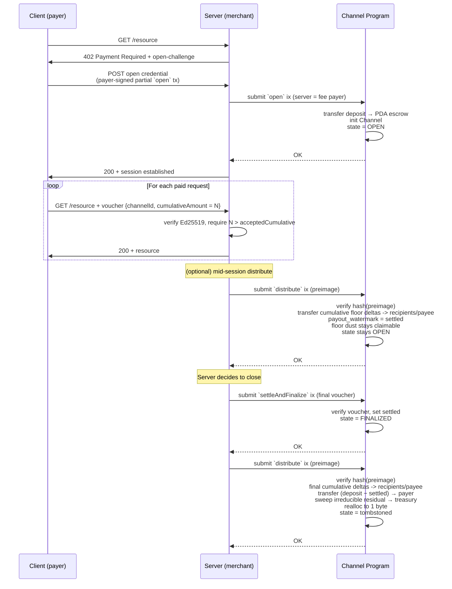
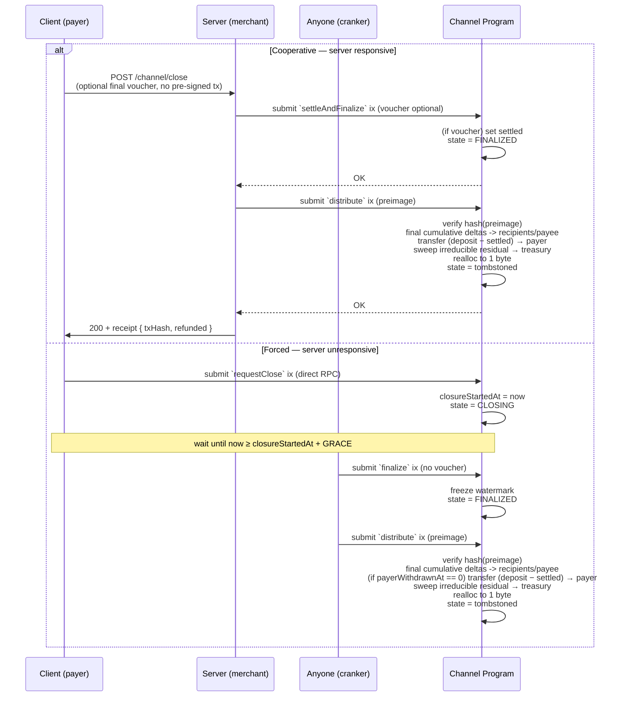

# ADR-002: HTTP Protocol & Session Lifecycle

**Status:** Draft

**Parent ADR:** ADR-001 Payment Channel State Machine

## Context

This ADR specifies the off-chain HTTP protocol for channel coordination, aligning with MPP [`draft-solana-session-00`](https://github.com/solana-foundation/mpp-specs/blob/a64edb477cfcb5e071e4f73f4227cf329dd1c4b5/specs/methods/solana/draft-solana-session-00.md).

## Decision

The client and server exchange payment credentials and vouchers. In the cooperative path, the server pays fees for the on-chain transactions it submits. Escape-route instructions (`requestClose`, `withdraw_payer`, `finalize`, `distribute`) are client-direct-to-RPC for when the server is unresponsive. Two canonical flows:

- **Happy path**: discovery -> open -> metered requests -> cooperative close (client `POST /channel/close`, server submits `settleAndFinalize` optionally bundled with `distribute`).
- **Forced close**: client broadcasts `requestClose` directly to RPC; after grace, anyone cranks `finalize` + `distribute`.

All on-chain instruction names referenced below are defined in ADR-001.

## HTTP Messages

Actors: **C** = client (payer). **S** = server (merchant).

| Direction | Transport | Wire shape | Drives on-chain ix |
|---|---|---|---|
| S → C | `402 Payment Required` + `WWW-Authenticate: Payment <auth-params>` header | auth-params: `id="…", method="solana", intent="session", request="<b64url-nopad(JCS(challenge-json))>"` | — |
| C → S | `POST /channel/open` | body: MPP credential envelope, `payload.action="open"`, carries `transaction` (base64 partial-signed open tx) | `open` |
| C → S | `GET <resource>` + `Authorization: Payment <b64url-nopad(JCS(credential-json))>` header | `payload.action="voucher"`, carries SignedVoucher | — (off-chain metering) |
| C → S | `POST /channel/topup` | body: MPP credential envelope, `payload.action="topUp"` (camelCase), carries `transaction` | `topUp` |
| C → S | `POST /channel/close` | body: MPP credential envelope, `payload.action="close"`, optional `payload.voucher` (SignedVoucher); no pre-signed tx | `settleAndFinalize` (optionally bundled with `distribute`) |
| S → C | Any 200 that accepted a voucher or submitted an on-chain tx on the client's behalf | `Payment-Receipt: <b64url-nopad(JSON)>` header | — |

### Notes

- **Minimum-deposit constraint:** `POST /channel/open` requires both `payload.depositAmount` and the decoded `open` instruction's `deposit` to be at least `challenge.methodDetails.minimumDeposit`. Enforced at the HTTP layer, not on-chain.
- **Grace-period constraint:** New-channel `POST /channel/open` requires `payload.gracePeriodSeconds == challenge.methodDetails.gracePeriodSeconds`. Before signing or submitting the transaction, the server MUST decode the `open` instruction data and reject unless encoded `grace_period` equals the same positive `u32`. The on-chain program rejects zero grace periods, but merchant-specific close-window policy is enforced at the HTTP layer. It is recommended to set the grace period to a realistic business-appropriate minimum, e.g. 15 minutes to allow for a final settlement, if client requests a close.
- **Server-submitted ixs:** `settle`, `settleAndFinalize`, and `distribute` are submitted directly by the server. In the cooperative path, the server triggers `distribute` (often bundled with `settleAndFinalize`) and may run mid-session distributes from `OPEN`.
- **PDA payees:** `open` allows `payee` to be either an on-curve address or a program-derived address (PDA) beneficiary. A direct `settleAndFinalize` transaction requires a signer equal to `Channel.payee`; PDA payees can use that cooperative-close path only through CPI from the owning program with signer seeds. Permissionless `settle`, `finalize`, and `distribute` remain available without a payee signature.
- **Escape routes are direct-to-chain:** The client submits these directly to Solana RPC:
  - `requestClose`: Payer-signed. Callable in `OPEN`. Starts the grace period.
  - `withdraw_payer`: Payer-signed. Callable in `FINALIZED`. Refunds `deposit - settled`.
  - `finalize`: Permissionless. Post-grace. Transitions `CLOSING -> FINALIZED`.
  - `distribute`: Permissionless in `OPEN` and `FINALIZED`. Caller supplies splits preimage; program verifies hash against `Channel.distribution_hash`. From `OPEN`, it pays cumulative floor deltas between `payout_watermark` and `settled` for each recipient and the payee's implicit remainder share, then advances `payout_watermark` to `settled`. Zero-delta shares are skipped, and floor dust remains in escrow so later cumulative deltas can still claim it. From `FINALIZED`, it runs the final cumulative floor deltas, refunds `deposit - settled` to the payer (if `payerWithdrawnAt == 0`), sweeps final irreducible residual dust to treasury, and tombstones the PDA. **SDK note:** distributions with 32 recipients require a version 0 transaction and an address lookup table indexing recipient ATAs; legacy transactions cannot fit the account-key budget.
- **Escape-route self-sufficiency:** Clients persist the 402 challenge and `channelId` to independently invoke escape routes.
- **Distribution commitment:** The PDA stores a 32-byte Blake3 digest of the splits preimage. Splits are passed to `open` and hashed on-chain, making them publicly recoverable from instruction data. `distribute` requires the caller to supply the preimage for hash verification.
- **PDA-canonical bump:** The `open` instruction data does not carry a client-supplied bump byte; the on-chain program derives the canonical bump via `find_program_address` and validates the channel PDA address directly. Clients MUST NOT include a `bump` field in the `POST /channel/open` payload, and servers MUST reject envelopes containing the field with HTTP 400. Silently accepting and ignoring a wire `bump` would mask client-side derivation bugs whose wrong bump pairs with a correct PDA address — exactly the inconsistency the on-chain address check cannot catch. Implementations whose deserializers currently model `bump` as a required field MUST remove it.
- **Vouchers are purely off-chain:** No on-chain transactions during metered requests.

### Server-Side Validation

To avoid paying Solana network fees for invalid transactions and to ensure protocol security, the server MUST perform the following validations off-chain before submitting any transactions:

1. **`POST /channel/open` Transaction Validation:** The server MUST treat the submitted base64 transaction, not the JSON envelope, as the authoritative open request. Before signing, paying fees for, or submitting it, the server MUST decode the transaction and validate the payment-channel instruction targets `challenge.methodDetails.channelProgram`, uses the `open` discriminator, and matches the challenge and payload exactly: `payer`, `payee`, `mint`, `authorizedSigner`, `salt`, `deposit`, `grace_period`, and the explicit `distributionSplits` preimage. The decoded `payee`, `mint`, `distributionSplits`, and `grace_period` MUST match the `402` challenge; the decoded `deposit` MUST equal `payload.depositAmount` and satisfy `deposit >= challenge.methodDetails.minimumDeposit`; and the decoded `authorizedSigner` MUST equal `payload.authorizedSigner`, be a valid Ed25519 public key, and may still be a delegated signer distinct from `payer`. The decoded `payee` may be a program-derived address (PDA) beneficiary; implementations choosing that pattern need CPI signer-seed control for direct cooperative `settleAndFinalize`. The server MUST persist the accepted signer with the channel, rederive the channel PDA from the decoded `payer`, `payee`, `mint`, `authorizedSigner`, and `salt`, verify it equals both the decoded `channel` account and `payload.channelId`, and verify the decoded escrow account is the ATA for `(channel, mint, tokenProgram)`. The decoded `tokenProgram` MUST match the challenged token program when supplied, otherwise one of the supported token programs for the mint. Reject any request where the envelope and decoded transaction disagree. Failing to do so allows a malicious client to alter the distribution to themselves, shorten the close window, underfund escrow, or open a different channel than the server will later meter.
2. **Voucher Validation:** Before accepting a metered request or submitting `settle` or `settleAndFinalize` with a voucher, the server MUST validate the `SignedVoucher` against the active channel context. `SignedVoucher.voucher.channelId` MUST equal the active channel PDA, `SignedVoucher.signer` MUST equal the channel's persisted `authorizedSigner`, and the Ed25519 signature MUST verify under that `authorizedSigner` over the Borsh-serialized voucher payload. The server MUST also check that `settled < cumulativeAmount <= deposit` and that the voucher is fresh (`expiresAt` is null or in the future). For metered requests, the server MUST persist the highest accepted cumulative watermark per active session and reject any voucher with `cumulativeAmount <= acceptedCumulative`, even when on-chain `settled` lags behind off-chain metering. The same channel, signer, signature, freshness, and on-chain watermark validation applies to any `SignedVoucher` carried in `POST /channel/close`.

**Challenge `request` object** (JCS-canonicalized then base64url-nopad into the `request` auth-param of `WWW-Authenticate: Payment`):

```json
{
  "amount": "<u64 decimal string — price per unit, in token base units>",
  "unitType": "<e.g. 'request' | 'token' | 'byte' — OPTIONAL>",
  "recipient": "<merchant pubkey base58>",
  "currency": "<SPL mint pubkey base58 — wrap SOL to wSOL>",
  "description": "<human-readable — OPTIONAL>",
  "externalId": "<server correlation id — OPTIONAL>",
  "methodDetails": {
    "network": "<'mainnet-beta' | 'devnet' | 'localnet' — REQUIRED, no default>",
    "channelProgram": "<pubkey base58 — REQUIRED; must be the explicitly deployed program for the selected network>",
    "channelId": "<pubkey base58 — OPTIONAL, resume existing channel>",
    "decimals": <integer 0-9 — REQUIRED when currency is an SPL mint>,
    "tokenProgram": "<pubkey base58 — OPTIONAL, SPL-Token or Token-2022>",
    "feePayer": <bool — OPTIONAL, true enables gasless flow>,
    "feePayerKey": "<pubkey base58 — REQUIRED when feePayer=true>",
    "minVoucherDelta": "<u64 decimal string — OPTIONAL; server-policy hint, not enforced on-chain>",
    "ttlSeconds": <integer — OPTIONAL; server-policy hint for voucher `expiresAt`, not enforced on-chain>,
    "gracePeriodSeconds": <integer — REQUIRED for new channel opens; merchant-selected close window in seconds, recommended 900>,

    // Solana-session extensions (not in MPP core; documented in Extensions section):
    "distributionSplits": [
      { "recipient": "<pubkey base58>", "shareBps": <integer 1–10000> }
      // 0..=MAX_SPLITS entries; every shareBps > 0; Σ shareBps ≤ 10000.
      // The remainder `10000 − Σ shareBps` is the payee's implicit share.
      // Merchant's proposed splits; forwarded by the client as inputs to
      // `open` (program canonicalizes + hashes on-chain).
    ],
    "minimumDeposit": "<u64 decimal string — hard floor enforced at HTTP layer, not on-chain>"
  }
}
```

`authorizedSigner` is client-chosen and carried in the open credential's `payload`. It MUST be a valid Ed25519 public key. It may equal `payer` or be a delegated signer, but once the channel is opened it is persisted with the channel and is the only valid voucher signer for that channel.

**SignedVoucher** (carried in `payload.voucher` of credentials; the inner `voucher` object is Borsh-serialized and Ed25519-signed by the channel's `authorizedSigner`, producing the base58 `signature`):

```json
{
  "voucher": {
    "channelId": "<PDA address base58>",
    "cumulativeAmount": "<u64 decimal string>",
    "expiresAt": "<RFC 3339 timestamp — OPTIONAL>"
  },
  "signer": "<authorizedSigner pubkey base58>",
  "signature": "<base58 Ed25519 sig over Borsh(voucher)>",
  "signatureType": "ed25519"
}
```

## Happy Path



## Client-Initiated Close



## Wire Examples

Concrete request/response blocks for each flow.

**Example 1: 402 challenge (S -> C)**

Unauthenticated client requests a metered resource:

```http
GET /api/v1/inference/completion HTTP/1.1
Host: merchant.example
```

Server responds with a `402` and `WWW-Authenticate: Payment` challenge:

```http
HTTP/1.1 402 Payment Required
WWW-Authenticate: Payment id="018f1a2b-7d1e-7c4a-9e12-3d0f5a8b2c4d",
    method="solana", intent="session",
    request="eyJyZWNpcGllbnQiOiJQYXllZU1lcmNoYW50MTIzNC4uLiJ9"
```

`request` is the MPP auth-param. Decoding its base64url-nopad value yields the challenge JSON:

```json
{
  "amount": "10",
  "unitType": "request",
  "recipient": "PayeeMerchant1234567890abcdefghijklmnop",
  "currency": "EPjFWdd5AufqSSqeM2qN1xzybapC8G4wEGGkZwyTDt1v",
  "methodDetails": {
    "network": "devnet",
    "channelProgram": "PayCh111111111111111111111111111111111111",
    "decimals": 6,
    "feePayer": true,
    "feePayerKey": "SrvrFeePayer9876543210zyxwvutsrqponmlkji",
    "gracePeriodSeconds": 900,
    "distributionSplits": [
      { "recipient": "PayeeMerchant1234567890abcdefghijklmnop", "shareBps": 9500 },
      { "recipient": "PltfrmFee456789abcdefghijklmnopqrstuv",   "shareBps":  500 }
    ],
    "minimumDeposit": "1000000"
  }
}
```

**Example 2: `POST /channel/open` (C -> S)**

```http
POST /channel/open HTTP/1.1
Host: merchant.example
Content-Type: application/json

{
  "id": "018f1a2b-7d1e-7c4a-9e12-3d0f5a8b2c4d",
  "method": "solana",
  "intent": "session",
  "payload": {
    "action": "open",
    "channelId": "ChA9XyZabcdef1234567890abcdef1234567890abc",
    "payer": "PayerAbcdef1234567890abcdef1234567890abcde",
    "payee": "PayeeMerchant1234567890abcdefghijklmnop",
    "mint": "EPjFWdd5AufqSSqeM2qN1xzybapC8G4wEGGkZwyTDt1v",
    "authorizedSigner": "PayerAbcdef1234567890abcdef1234567890abcde",
    "salt": "42",
    "depositAmount": "1000000",
    "gracePeriodSeconds": 900,
    "distributionSplits": [
      { "recipient": "PayeeMerchant1234567890abcdefghijklmnop", "shareBps": 9500 },
      { "recipient": "PltfrmFee456789abcdefghijklmnopqrstuv",   "shareBps":  500 }
    ],
    "transaction": "AQABA4...base64-partial-signed-open-tx..."
  }
}
```

**Example 3: Metered `GET` with voucher (C -> S)**

```http
GET /api/v1/inference/completion HTTP/1.1
Host: merchant.example
Authorization: Payment eyJpZCI6IjAxOGYxYTJiLi4uIiwibWV0aG9kIjoic29sYW5hIi...
```

`Authorization: Payment <…>` decodes to:

```json
{
  "id": "018f1a2b-7d1e-7c4a-9e12-3d0f5a8b2c4d",
  "method": "solana",
  "intent": "session",
  "payload": {
    "action": "voucher",
    "voucher": {
      "voucher": {
        "channelId": "ChA9XyZabcdef1234567890abcdef1234567890abc",
        "cumulativeAmount": "42500"
      },
      "signer": "PayerAbcdef1234567890abcdef1234567890abcde",
      "signature": "5J7k...base58-Ed25519-sig-64-bytes...",
      "signatureType": "ed25519"
    }
  }
}
```

**Example 4: `POST /channel/topup` (C -> S)**

```http
POST /channel/topup HTTP/1.1
Content-Type: application/json

{
  "id": "018f1c3d-…",
  "method": "solana",
  "intent": "session",
  "payload": {
    "action": "topUp",
    "channelId": "ChA9XyZabcdef1234567890abcdef1234567890abc",
    "additionalAmount": "500000",
    "transaction": "AQABA...base64-partial-signed-topUp-tx..."
  }
}
```

**Example 5: `POST /channel/close` (C -> S)**

```http
POST /channel/close HTTP/1.1
Content-Type: application/json

{
  "id": "018f1d4e-…",
  "method": "solana",
  "intent": "session",
  "payload": {
    "action": "close",
    "channelId": "ChA9XyZabcdef1234567890abcdef1234567890abc",
    "voucher": {
      "voucher": {
        "channelId": "ChA9XyZabcdef1234567890abcdef1234567890abc",
        "cumulativeAmount": "842500",
        "expiresAt": "2026-04-20T18:30:00Z"
      },
      "signer": "PayerAbcdef1234567890abcdef1234567890abcde",
      "signature": "5J7k...base58-Ed25519-sig...",
      "signatureType": "ed25519"
    }
  }
}
```

`voucher` is OPTIONAL. When present, the carried `SignedVoucher` MUST be bound to the close request's active channel: `SignedVoucher.voucher.channelId` equals `payload.channelId`, `SignedVoucher.signer` equals the channel's `authorizedSigner`, and the Ed25519 signature verifies under that signer. It MUST strictly advance the on-chain watermark (`settled < voucher.cumulativeAmount`); a supplied voucher at or below the current `settled` watermark is invalid and MUST cause `settleAndFinalize` to reject. If no final settle is needed, send the close request without a voucher so the channel finalizes at the current on-chain `settled` watermark.

**Example 6: Successful response with `Payment-Receipt` (S -> C)**

```http
HTTP/1.1 200 OK
Content-Type: application/json
Payment-Receipt: eyJtZXRob2QiOiJzb2xhbmEiLCJpbnRlbnQiOiJzZXNzaW9uIi...

{ "data": "...resource body or empty..." }
```

`Payment-Receipt` decodes to:

```json
{
  "method": "solana",
  "intent": "session",
  "reference": "ChA9XyZabcdef1234567890abcdef1234567890abc",
  "status": "success",
  "timestamp": "2026-04-20T18:42:03Z",
  "challengeId": "018f1a2b-7d1e-7c4a-9e12-3d0f5a8b2c4d",
  "acceptedCumulative": "42500",
  "spent": "250"
}
```

On close-receipt responses (`POST /channel/close`), add `"txHash": "<base58 solana sig>"` identifying the `settleAndFinalize` tx the server submitted (optionally bundled with `distribute`), and (if the bundled `distribute` ran) `"refunded": "<u64 decimal>"` for the `deposit - settled` branch paid back to the payer.
