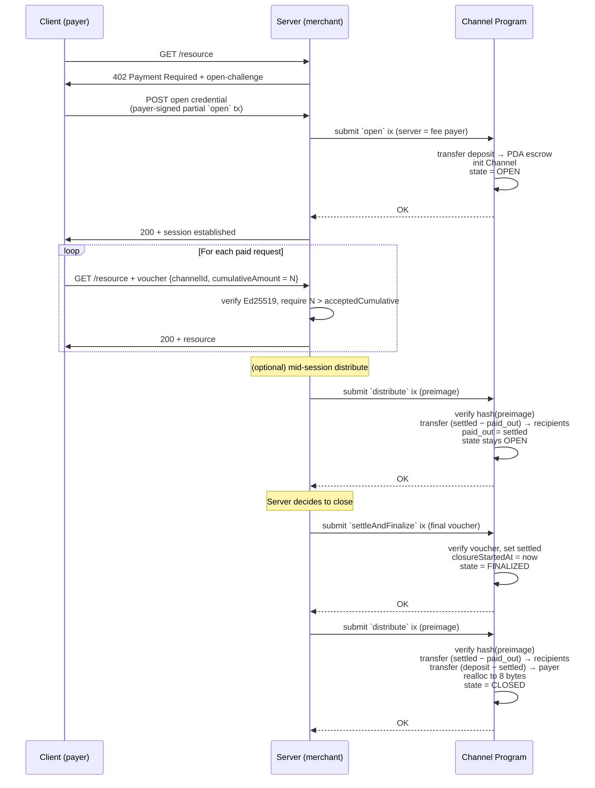
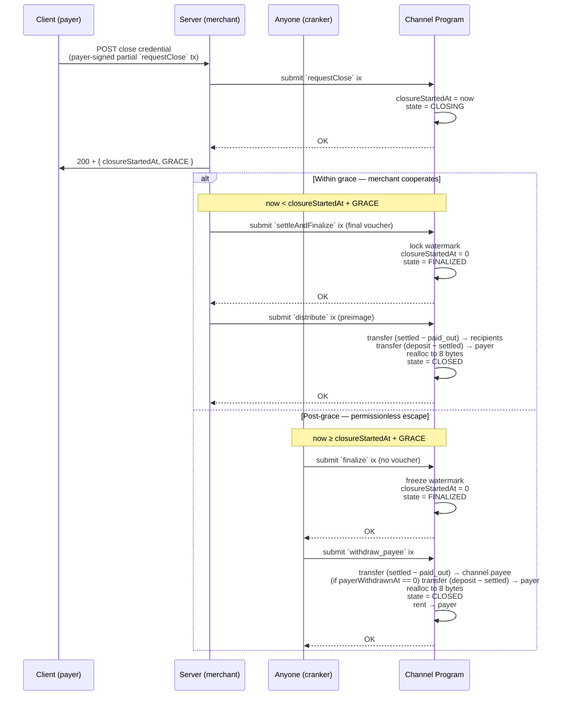

# ADR-002: HTTP Protocol & Session Lifecycle

**Status:** Draft

**Parent ADR:** ADR-001 — Payment Channel State Machine

## Context

ADR-001 specifies the on-chain channel program. This ADR specifies the **off-chain HTTP protocol** that drives it: how a client and merchant server coordinate to open a channel, pay per request via off-chain vouchers, and close the channel cooperatively or unilaterally. It aligns with the MPP [`draft-solana-session-00`](https://github.com/solana-foundation/mpp-specs/blob/a64edb477cfcb5e071e4f73f4227cf329dd1c4b5/specs/methods/solana/draft-solana-session-00.md) session-flow semantics.

## Decision

The client and server exchange **payment credentials** (HTTP-layer objects that carry partially-signed on-chain transactions) and **vouchers** (payer-signed off-chain cumulative-amount assertions). The server is the fee payer for every on-chain transaction — clients never submit transactions directly. Two canonical flows cover the lifecycle:

- **Happy path**: discovery → open → metered requests → server-initiated cooperative close.
- **Client-initiated close**: client requests closure; resolves either within the grace period (merchant cooperates) or after the grace period (permissionless escape).

All on-chain instruction names referenced below are defined in ADR-001.

## HTTP Messages

Actors: **C** = client (payer). **S** = server (merchant).

| Direction | Method · Path | Payload | Drives on-chain ix | Purpose |
|---|---|---|---|---|
| S → C | `402 Payment Required` | open-challenge JSON (below) | — | Advertise open parameters when no channel exists |
| C → S | `POST /channel/open` | `{ action: "open", tx: <base64> }` | `open` | Submit payer-signed partial `open` tx |
| C → S | `GET <resource>` + `Mpp-Voucher` header | voucher (below), Ed25519-signed | — (off-chain) | Pay for one metered request |
| C → S | `POST /channel/topup` | `{ action: "topup", tx: <base64> }` | `topUp` | Submit payer-signed partial `topUp` tx |
| C → S | `POST /channel/close` | `{ action: "close", tx: <base64> }` | `requestClose` | Submit payer-signed partial `requestClose` tx |
| C → S | `POST /channel/withdraw_payer` | `{ action: "withdraw_payer", tx: <base64> }` | `withdraw_payer` | Submit payer-signed partial `withdraw_payer` tx |
| C → S | `POST /channel/finalize` | — | `finalize` | Crank post-grace freeze of the watermark |
| C → S | `POST /channel/withdraw_payee` | — | `withdraw_payee` | Crank payee payout (`(settled − paid_out) → channel.payee`) |

Two categories:

- **Credential endpoints** (`/open`, `/topup`, `/close`, `/withdraw_payer`) carry a **partially-signed Solana transaction** (base64). Payer signs the authority portion; the server co-signs as fee payer and submits. Required because these ixs need payer authority.
- **Crank endpoints** (`/finalize`, `/withdraw_payee`) have **empty bodies**. The underlying on-chain ixs are permissionless; the server submits as fee payer purely as a convenience for clients that don't want to manage an RPC connection. A client may equivalently submit these ixs **directly to Solana RPC** without the server's cooperation — this is the escape hatch when the server is unresponsive.

Server-submitted ixs (`settle`, `settleAndFinalize`, `distribute`) are never exposed over HTTP; the server submits them on its own schedule. `distribute` is technically permissionless (preimage is the authority), but in practice only the server holds the preimage, so it acts as the de-facto caller — including for mid-session distributes from `OPEN` state when the server wants to realize accumulated `settled` revenue without closing the channel.

Vouchers are purely off-chain — no tx involved.

**Open-challenge body** (returned in `402`):

```json
{
  "action": "open",
  "payee": "<pubkey base58>",
  "mint": "<pubkey base58>",
  "minimumDeposit": "<u64 decimal string>",
  "distributionHash": "<16 bytes hex>",
  "authorizedSigner": "<pubkey base58, may equal payer>",
  "gracePeriod": <unix seconds>
}
```

`minimumDeposit` is a **floor** enforced at the HTTP layer: the server MUST reject any `open` credential whose deposit is below this value. The on-chain program does not check it — a too-small channel only wastes the opener's own rent and fees and exposes the merchant to nothing, so the policy belongs at the application edge.

**Voucher payload** (JCS-canonicalized, Ed25519-signed by payer, base58-encoded):

```json
{
  "channelId": "<PDA address base58>",
  "cumulativeAmount": "<u64 decimal string>",
  "expiresAt": <optional unix seconds>
}
```

## Happy Path



On first unpaid request the server returns `402` with the open-challenge. The client signs a partial `open` tx (authorizing the deposit transfer), POSTs it as a credential; the server co-signs as fee payer and submits. Once `OPEN`, the client pays per request with an Ed25519-signed voucher — purely off-chain. When the server closes, `settleAndFinalize` locks the final watermark and `distribute` executes the hash-committed splits plus payer refund, tombstoning the PDA.

## Client-Initiated Close



The client POSTs a close credential (payer-signed `requestClose` tx); the server submits it and grace begins. **Within grace**, the server finalizes cooperatively via `settleAndFinalize` + `distribute`. **Post-grace**, anyone cranks `finalize` (permissionless, voucher-free) to move `CLOSING → FINALIZED`, then `withdraw_payee` to atomically pay `settled → channel.payee`, refund `deposit − settled → payer` (if not already withdrawn), and tombstone the PDA. The payer may also pull their refund early at any point during `FINALIZED` via the standalone `withdraw_payer` ix.
